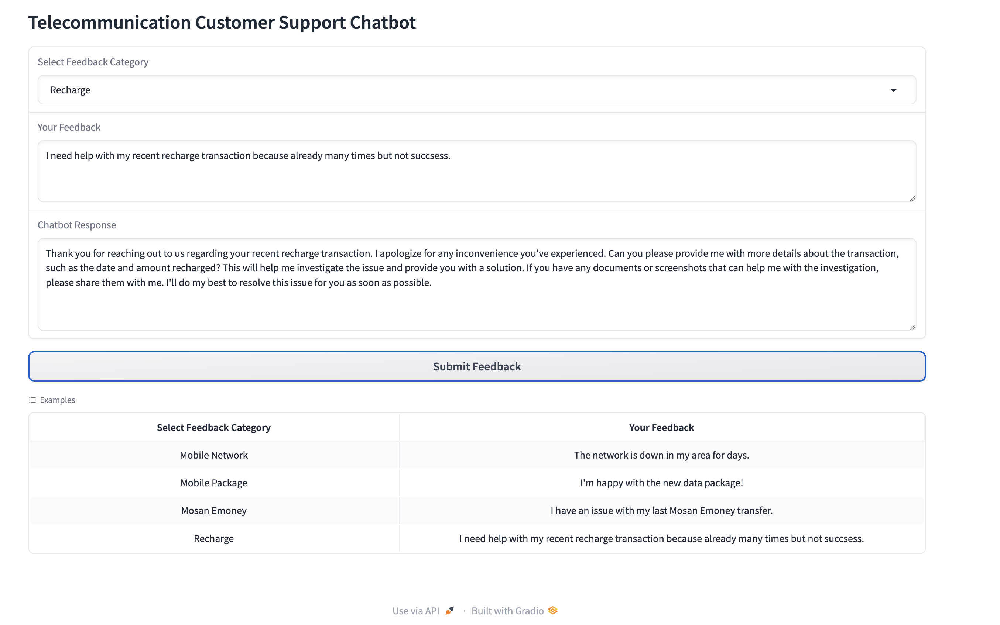
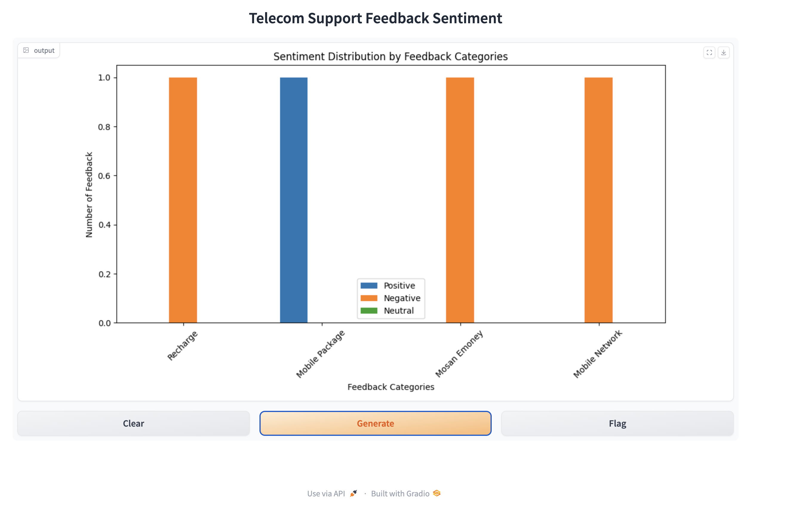

# TELE Feedback

Tele Feedback is a chatbot designed for telecommunications companies in Timor-Leste. This project allows users to provide feedback and interact with an AI chatbot. It integrates **sentiment analysis** to gauge the tone of customer feedback and stores the data for further analysis, helping the company better understand customer sentiment. This project is part of [LLM Foundations with Python on stackup.dev](https://earn.stackup.dev/campaigns/llm-foundations-with-python-2162).

---

🎉 𝐄𝐱𝐜𝐢𝐭𝐢𝐧𝐠 𝐍𝐞𝐰𝐬! 🎉

I’m thrilled to share that I’ve successfully completed a bounty challenge on StackUp and earned a $20 𝒓𝒆𝒘𝒂𝒓𝒅! 💸 The challenge involved enhancing a Llama chatbot by integrating sentiment analysis using Hugging Face Transformers, allowing the bot to adjust responses based on user sentiment. It was an incredible learning experience working with Large Language Models (LLMs) and furthering my skills in chatbot development.

Check out my LinkedIn post about the accomplishment: [LinkedIn](https://www.linkedin.com/posts/ajitonelson_ai-chatbots-llms-activity-7249259914362019840-2-T-?utm_source=share&utm_medium=member_desktop)

---

## Features

- **Interactive Chatbot**: Customers can chat with the bot, which provides automated responses.
- **Sentiment Analysis**: Each customer message is analyzed to determine its sentiment (positive, neutral, or negative).
- **Feedback Storage**: The chatbot collects and stores customer inputs, chatbot responses, and sentiment data in a database.
- **Data Visualization**: Provides insights into the sentiment trends from customer feedback using visual charts.

## Tech Stack

- **Python**
- **Hugging Face Transformers** for language models and sentiment analysis
- **Gradio** for the user interface
- **SQLAlchemy** for database interactions
- **Pandas** and **Matplotlib** for data manipulation and visualization

## Setup in Google Colab

To run this project in **Google Colab**, follow these steps:

1. Open the notebook in Google Colab by clicking the link below:

   [Open Tele Feedback in Google Colab](https://colab.research.google.com/github/ajitonelsonn/TELE_Feedback/blob/main/Llama_Chatbot_with_Sentiment_Analysis_Integration_TL.ipynb)

2. **Change the Runtime:**

   - Once the notebook is opened, go to the top menu and click **Runtime > Change runtime type**.
   - Select **T4 GPU** as the hardware accelerator to optimize performance, then click **Save**.

3. **Update Hugging Face Token:**

   - In the notebook, find the code cell where the Hugging Face token is required (near the login section).
   - Replace `"your_huggingface_token_here"` with your own Hugging Face token. You can get the token from your Hugging Face account by visiting [huggingface.co](https://huggingface.co/).

   ```python
   from huggingface_hub import login
   login(token="your_huggingface_token_here")
   ```

4. Run the notebook to launch the chatbot and feedback system.

## Usage

1. **Launching the Chatbot**:

   - Run the script to start the chatbot interface.
   - Users can input text to chat with the bot, and the bot will generate responses based on pre-trained language models.

2. **Sentiment Analysis**:

   - Each user input will be analyzed to determine the sentiment: positive, neutral, or negative.

3. **Storing Feedback**:

   - After each interaction, feedback (user input, chatbot response, sentiment) is automatically saved to an SQLite database.

4. **Visualizing Feedback**:

   - You can view feedback data in tabular format or as a chart showing sentiment trends by running the respective Gradio interfaces.

## Screenshots

### Chatbot Interface



### Sentiment Trend



## Future Improvements

- Add multi-language support for the chatbot.
- Improve the sentiment analysis by training a domain-specific model.
- Implement an admin panel to review and manage feedback.

## License

This project is licensed under the MIT License - see the [LICENSE](LICENSE) file for details.

---

## **About the Author**

**Ajito Nelson** is a passionate **Big Data Engineer** and **AI Enthusiast**. With a deep interest in data-driven solutions and artificial intelligence, Ajito is dedicated to leveraging cutting-edge technology to solve complex challenges. His expertise spans across big data infrastructure, machine learning, and AI applications in various domains.

You can connect with me on [LinkedIn](https://www.linkedin.com/in/ajitonelson/).


